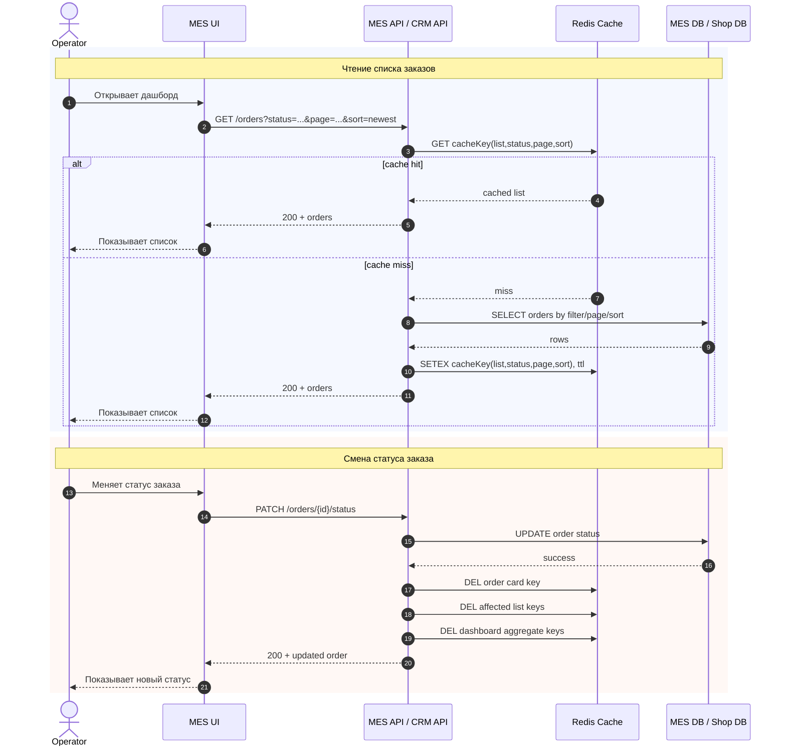

# Архитектурное решение по кешированию

## 1. Контекст и проблема

В этом задании нужно решить две связанные проблемы из исходного описания системы:

1. операторы жалуются на медленную первую страницу `MES`, где показывается список заказов в работе по статусам;
2. бизнес недоволен общей скоростью прохождения заказа.

Из предыдущих заданий уже видна важная картина:

- `MES API` перегружен и одновременно занимается расчётом стоимости, B2B API, дашбордом операторов, статусами и работой с очередью;
- `MES` должен остаться расчётным контуром, а backoffice-сценарии со временем должны переехать на `CRM API`;
- Предусмотрены метрики чтения списка заказов, saturation `MES db` и деградации операторского контура;
- Мониторинги и логи к этому моменту уже настроены, значит влияние кеширования потом можно будет измерять, а не оценивать на глаз.

Отсюда следует, что кеширование нужно проектировать в двух горизонтах:

- **Этап 1 — easy wins на текущей архитектуре**, чтобы мгновенно снять боль операторов;
- **Этап 2 — кеширование в целевой архитектуре**,

## 2. Что имеет смысл кешировать

### 2.1. Easy wins на текущей архитектуре

В текущем состоянии главный кандидат на кеширование — **read path операторского дашборда в `MES UI`**.

#### Что кешировать в первую очередь

1. **Список заказов на первой странице `MES UI`**
   - заказы в работе по статусам;
   - выборки по фильтрам;
   - сортировка по самым новым заказам;
   - постраничные представления.

2. **Агрегаты для дашборда операторов**
   - счётчики заказов по статусам;
   - summary-блоки для верхней части экрана;
   - горячие фильтры, которые используются чаще всего.

3. **Редко меняющиеся UI-справочники**
   - список статусов;
   - допустимые фильтры;
   - служебные словари для интерфейса.

#### Почему именно это

- именно этот экран описан как главная текущая боль бизнеса;
- это read-heavy сценарий;
- фильтр и пагинация уже внедрялись, но сами по себе проблему не решили;
- данные читаются часто, а изменяются существенно реже, чем запрашиваются.

### 2.2. Целевая картина архитектуры

В итоге основной read-heavy кеш должен переместиться ближе к тем API, которые реально обслуживают интерфейсы и запросы пользователей.

#### Что кешировать в target state

1. **Backoffice read-модели в `CRM API`**
   - списки заказов для продавцов и операторов;
   - карточки заказа при частом чтении;
   - агрегаты по статусам;
   - представления для dashboard и поиска.

2. **Чтение статуса и метаданных заказа в `Shop API`**
   - статус заказа для B2C;
   - метаданные по заказу;
   - почти неизменяемые справочники, влияющие на пользовательский сценарий.

3. **Результат расчёта стоимости — только при отдельном обосновании**
   - кешировать цену допустимо только если результат действительно детерминирован входными данными;
   - должен существовать надёжный ключ кеша;
   - нужно учитывать версию алгоритма расчёта и риск использования устаревшей цены.

### 2.3. Что не нужно кешировать как базовое решение

- весь жизненный цикл заказа целиком;
- сырые события в `RabbitMQ`;
- все записи БД без разбора access pattern;
- тяжёлый расчёт стоимости как “чёрный ящик” без проверки повторяемости результата.

## 3. Мотивация

Кеширование нужно как способ решить конкретные проблемы производительности и снизить давление на самые перегруженные части системы.

### Что это даст сейчас

- ускорит открытие первой страницы `MES UI` для операторов;
- уменьшит нагрузку на `MES API` и `MES db` в read-heavy сценарии;
- сократит конкуренцию между чтением списка заказов и расчётом стоимости;
- снизит число повторных запросов к БД для одних и тех же фильтров;
- улучшит UX операторов без немедленной полной перестройки архитектуры.

### Что это даст в целевой картине

- позволит строить быстрые read-модели для `CRM API` и `Shop API`;
- уменьшит latency пользовательских и backoffice-сценариев;
- сделает масштабирование дешевле, потому что часть нагрузки останется в кеше, а не уйдёт в БД;
- упростит отделение read-сценариев от расчётного контура `MES`.

### Технические и бизнес-метрики, на которые повлияет решение

1. Время загрузки первой страницы `MES`.
2. p95/p99 latency чтения списка заказов.
3. Нагрузка на `MES API` и число тяжёлых запросов к `MES db`.
4. Число операторских жалоб на медленную работу дашборда.
5. Время реакции оператора на появление нового заказа.

## 4. Предлагаемое решение

### 4.1. Выбор типа кеширования

Предлагается использовать **двухуровневое кеширование**:

- **серверное кеширование** — для списков заказов, агрегатов и read-heavy API-сценариев;
- **клиентское кеширование** — только для лёгких вспомогательных данных и UX-оптимизаций.

#### Почему не ограничиваться только клиентским кешем

Клиентский кеш улучшит локальный UX, но не снимет основную проблему: перегрузку `MES API` и `MES db`. Главная боль находится не только в браузере, а на стороне backend read path.

#### Почему не делать только серверный кеш везде

Потому что часть данных действительно удобно хранить на клиенте:

- справочники;
- параметры фильтров;
- краткоживущее повторное открытие уже просмотренного экрана.

### 4.2. Этап 1 — быстрое внедрение на текущей архитектуре

#### Где размещать кеш

На первом этапе разумно использовать выделенный распределённый in-memory кеш рядом с `MES API`, например managed Redis.

#### Что будет происходить

1. `MES` UI запрашивает список заказов.
2. `MES API` проверяет кеш по ключу, который учитывает:
   - статус;
   - фильтр;
   - страницу;
   - сортировку.
3. При cache hit ответ возвращается сразу.
4. При cache miss `MES API` читает `MES db`, заполняет кеш и отдаёт результат.
5. Для верхних агрегатов по статусам используется отдельный набор ключей.

#### Почему это даст быстрый эффект

- требует минимальных изменений по сравнению с полной перестройкой `MES`;
- не меняет доменную модель заказа;
- хорошо сочетается с текущей архитектурой и может быть внедрено итеративно;
- сразу разгружает read path операторского дашборда.

### 4.3. Этап 2 — целевое решение

После того как backoffice-сценарии смещаются в `CRM API`, основной кеш должен обслуживать уже не временный read path в `MES`, а целевые read-модели.

#### Целевая схема

- `CRM API` хранит и обслуживает кеш списков заказов, карточек и дашбордов backoffice;
- `Shop API` использует отдельный read-cache для пользовательских сценариев;
- `MES` остаётся расчётным контуром и не тратит ресурсы на массовые UI-чтения.

### 4.4. Выбор паттернов кеширования

#### Базовый паттерн — `Cache-Aside`

Основным паттерном для обоих этапов предлагаю выбрать `Cache-Aside`.

Почему:

- это стандартный и наиболее распространённый подход для read-heavy сценариев;
- он позволяет добавлять кеш без глубокой перестройки write path;
- он особенно хорошо подходит для списков и карточек, которые читаются значительно чаще, чем изменяются.

#### Где полезен `Refresh-Ahead`

Для самых горячих экранов в target state можно добавить `Refresh-Ahead` поверх базового `Cache-Aside`:

- агрегаты по статусам;
- верхние summary-блоки дашборда;
- самые часто читаемые списки по фиксированным фильтрам.

Почему:

- эти ключи читаются предсказуемо и часто;
- важно избегать регулярных cache miss в горячем UI-сценарии;
- к моменту target state появятся метрики из `Task2`, чтобы понять, какие ключи действительно горячие.

#### Почему `Write-Through` не основное решение

`Write-Through` хуже подходит как базовый вариант, потому что:

- текущая система уже сложная и событийная;
- write path проходит через несколько систем и статусов;
- синхронное обязательное обновление кеша на каждой записи усложнит критический путь;
- быстрые победы нужны именно на чтении, а не на усложнении записи.

Поэтому `Write-Through` можно рассматривать только как узкий частный вариант, но не как основу всего решения.

## 5. Sequence diagram

Ниже диаграмма для двух обязательных операций: чтение списка заказов и запись изменения статуса заказа.

## 6. Стратегия инвалидации кеша

Для этого решения не подходит только временная инвалидация или только ручной сброс. Нужна **комбинированная стратегия**.

### 6.1. Что предлагаю

#### Для этапа быстрых побед

- **короткий TTL** для списков заказов;
- **программная инвалидация по ключам** после записи;
- **отдельная инвалидация агрегатов** по статусам.

#### Для target state

- программная инвалидация от доменных событий;
- TTL как страховка от накопления устаревших данных;
- при необходимости `Refresh-Ahead` для самых горячих ключей.

### 6.2. Какие события должны инвалидировать кеш

1. создание нового заказа;
2. завершение расчёта стоимости;
3. смена статуса заказа;
4. взятие заказа оператором в работу;
5. закрытие заказа.

### 6.3. Почему не подходит только TTL

Только TTL даёт слишком слабую гарантию свежести:

- оператор может увидеть устаревший список заказов;
- новый заказ может появиться с задержкой;
- после смены статуса экран может оставаться неконсистентным до истечения TTL.

### 6.4. Почему не подходит только глобальный сброс кеша

Полный сброс после каждой записи слишком дорог:

- создаст лишние cache miss;
- не даст выиграть на горячих экранах;
- приведёт к скачкам нагрузки на БД.

Поэтому правильнее инвалидировать **затронутые ключи**, а не весь кеш.

## 7. Компромиссы и ограничения

1. Кеш не устраняет корневую архитектурную проблему, если `MES API` продолжает совмещать расчёт и backoffice.
2. Слишком длинный TTL опасен для операторского интерфейса, где важны самые новые заказы.
3. Слишком агрессивная инвалидация сведёт пользу кеша к нулю.
4. Кеширование результатов расчёта стоимости без строгого правила идентичности входов может привести к ошибочной цене.
5. Без метрик и алертов будет сложно подобрать правильные TTL и понять, действительно ли кеш работает эффективно.

## 8. Итог

Для `Александрита` оптимально не пытаться одним шагом решить всё кешированием. Нужна двухэтапная стратегия:

- **сейчас** — быстро ускорить операторский дашборд в `MES` через серверный кеш списка заказов и агрегатов по статусам, дополнив его лёгким клиентским кешем справочников;
- **потом** — перенести основной read-heavy кеш в целевые backoffice и пользовательские API, когда роли сервисов будут разделены.

Базовым паттерном должен стать `Cache-Aside`, а для самых горячих ключей в целевой картине можно добавить `Refresh-Ahead`. Инвалидация должна быть не только по времени, но и по доменным событиям изменения заказа. Именно такой подход даёт быстрый практический эффект сейчас и остаётся совместимым с архитектурной траекторией из предыдущих заданий.
